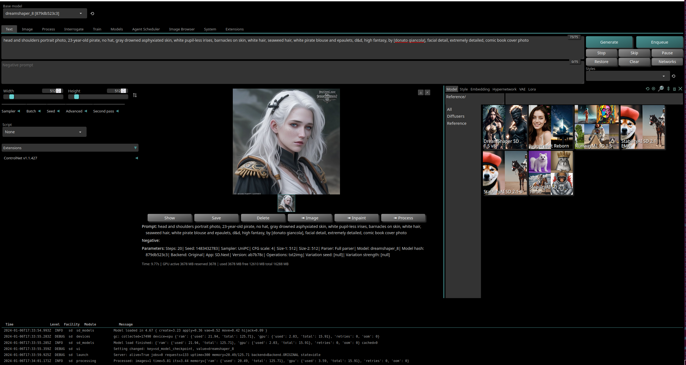

# Foreword
This repo was created for anyone curious as to what is going on with Intel GPUs in regards to Stable Diffusion. 

# Current Articles
  * [GIMP Stable Diffusion](https://game.intel.com/us/stories/intel-arc-graphics-stable-diffusion/): Could not get this working but I am not one who works with photo editing software.
  * [GIMP Stable Diffusion Update](https://www.youtube.com/watch?v=YCK7WPo7PKo): I will look at this at some point in the future.

# Operating System
This repo was put together with my [intel gpu machine](https://github.com/vampireLibrarianMonk/intel-gpu-hello) operating on Ubuntu 22.4.03. 

# Getting Started
1. Follow the directions for GPU Monitoring Software, Resizeable BAR, Driver and Intel® oneAPI Base Toolkit [here](https://github.com/vampireLibrarianMonk/intel-gpu-hello) in order to setup and use the GPU monitoring software.

2. Install git and python virtual environment:
```bash
sudo apt install git python3-venv -y
```

4. Read through the following [repo](https://github.com/vladmandic/automatic/wiki/Installation), then clone the repo:
```bash
git clone https://github.com/vladmandic/automatic
```

5. Run with the Intel OneAPI XPU:
```bash
cd automatic && ./webui.sh --debug --use-ipex
```

6. Allow software to install.

7. Diagnose any errors via the repo itself or another source:

8. Got to the listed local url

9. ```bash
   12:25:49-890393 INFO     Local URL: http://127.0.0.1:7860/
   ```
   
10. I have only successfully utilized the following models:
  * DreamShaper SD 1.5 v8
  * Juggernaut Reborn
  * Runway SD 1.5

11. Try a prompt via this [post](https://www.reddit.com/r/StableDiffusion/comments/wve7cs/repeatable_prompt_format_for_dnd_character/?rdt=35615) from Reddit I found:
```bash
head and shoulders portrait photo, 23-year-old pirate, no hat, gray drowned asphyxiated skin, white pupil-less irises, barnacles on skin, white hair, seaweed hair, white pirate blouse and epaulets, d&d, high fantasy, by [donato giancola], facial detail, extremely detailed, comic book cover photo 
```

